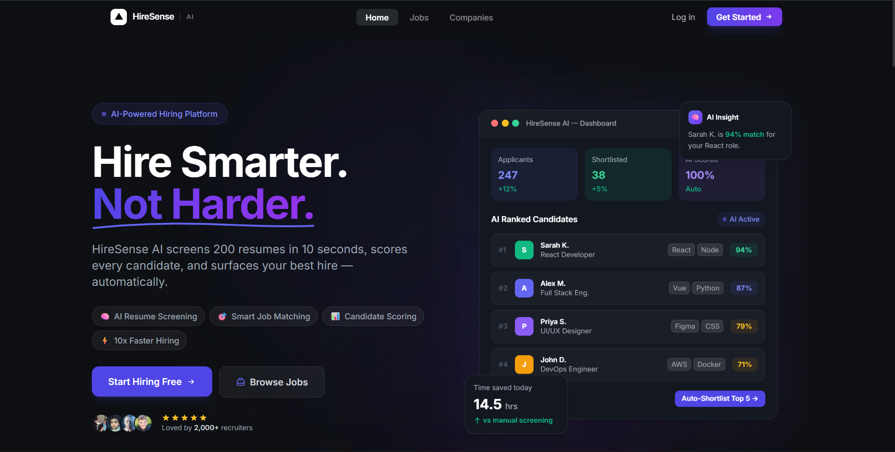
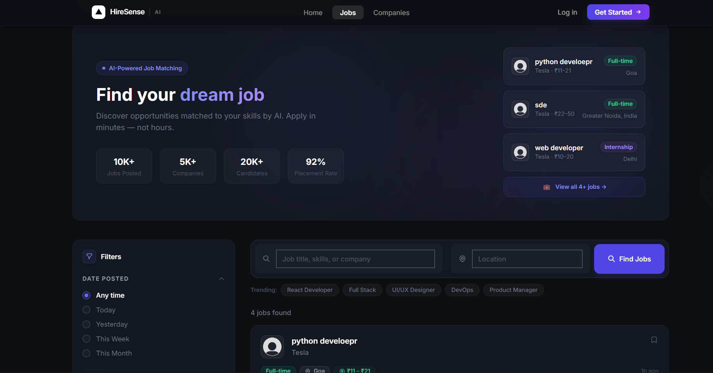
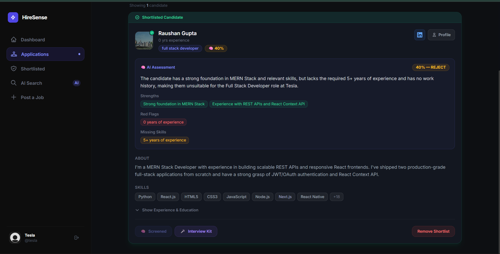
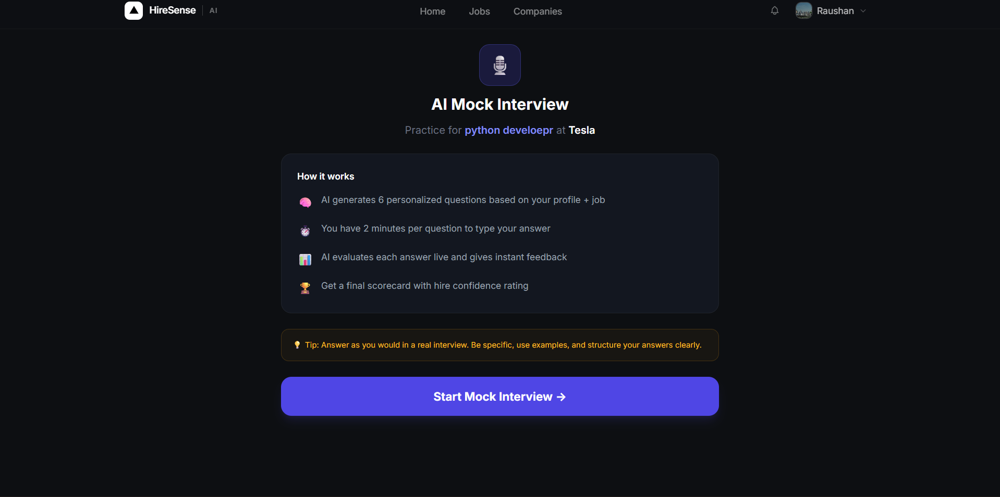
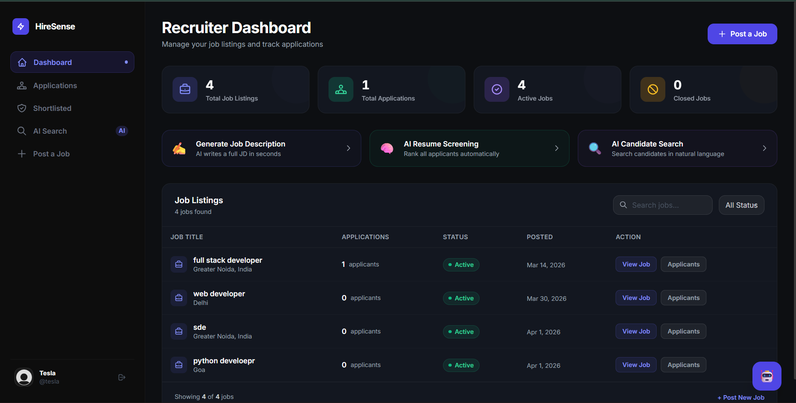
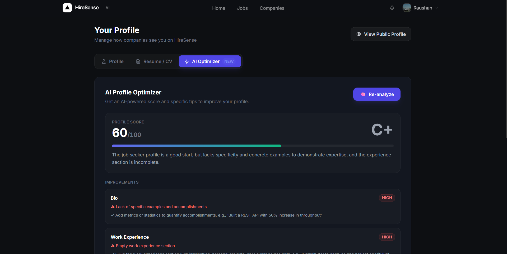

# HireSense AI

> AI-Powered Hiring Platform — Built for Recruiters and Job Seekers


[Live Demo](https://hiresense-ai-two.vercel.app) · [Report a Bug](https://github.com/RaushanGupta1516/HireSense-AI/issues) · [Request a Feature](https://github.com/RaushanGupta1516/HireSense-AI/issues)

---

## Table of Contents

- [Overview](#overview)
- [Features](#features)
- [Tech Stack](#tech-stack)
- [Getting Started](#getting-started)
- [Project Structure](#project-structure)
- [Usage](#usage)
- [API Reference](#api-reference)
- [Configuration](#configuration)
- [Screenshots](#screenshots)
- [Deployment](#deployment)
- [Testing](#testing)
- [Styling and Accessibility](#styling-and-accessibility)
- [Contributing](#contributing)
- [Changelog](#changelog)
- [FAQ](#faq)
- [License](#license)
- [Contact](#contact)

---

## Overview

HireSense AI is a full-stack, two-sided hiring platform that uses AI to automate
the most painful parts of recruitment — for both sides of the table.

**Recruiters** waste hours manually screening resumes that don't match.
**Job seekers** apply blindly to dozens of roles with no feedback and no idea
why they get rejected.

HireSense AI fixes both. Recruiters get AI-powered screening, ranking, and
interview preparation. Job seekers get match scores, skill gap analysis, mock
interviews, and profile optimization — all before they even hit apply.

### Who is this for?

| User | Use Case |
| :--- | :--- |
| **Recruiters / HR Managers** | Screen large applicant pools fast, rank by fit, generate interview kits |
| **Job Seekers** | Understand match before applying, identify skill gaps, practice interviews |
| **Startup Hiring Teams** | Enterprise-grade ATS features without the enterprise price tag |

---

## Features

### AI Features — Powered by Llama 3.3 70B via Groq

**For Recruiters:**

| Feature | What it does |
| :--- | :--- |
| AI Job Description Generator | Generates a full formatted HTML job description from a title and requirements |
| AI Resume Screener | Scores a resume against a job — returns strengths, red flags, missing skills and a hire/reject recommendation |
| AI Candidate Ranker | Ranks all applicants for a role by fit score with one click |
| AI Interview Kit Generator | Creates tailored technical, behavioural and red-flag questions per candidate |
| AI Candidate Search | Natural language search across your entire applicant pool |
| AI Recruiter Chat | Floating assistant that answers questions about candidates and your pipeline |

**For Job Seekers:**

| Feature | What it does |
| :--- | :--- |
| AI Job Match Score | Real-time percentage match shown on every job card before applying |
| AI Skill Gap Analysis | Shows matched and missing skills between your profile and a job |
| AI Salary Estimator | Low/mid/high salary bands with negotiation tips for any role |
| AI Mock Interview | Full interview simulation with live AI evaluation and a final scorecard |
| AI Profile Optimizer | Scores your profile 0-100, rewrites your bio, flags missing sections |
| AI Resume Parser | Extracts structured data from an uploaded PDF resume |
| AI Cover Letter Generator | Generates tailored cover letters with selectable tone |

### Core Platform Features

- Role-based auth — separate experiences for `jobSeeker` and `employer`
- Google OAuth 2.0 sign-in via Passport.js
- JWT authentication with automatic refresh token rotation
- Job posting, editing and management dashboard
- Application tracking with shortlist pipeline
- Save jobs and view saved jobs list
- Real-time notifications when application status changes
- Public candidate profiles
- Company profiles with logo upload
- Resume upload and management
- Skills management with autocomplete
- Shortlist export as CSV

---

## Tech Stack

### Frontend

| Technology | Purpose |
| :--- | :--- |
| React 18 + Vite | UI framework with fast HMR builds |
| Redux Toolkit | Global auth state management |
| React Router v6 | Client-side routing with protected routes |
| Tailwind CSS | Utility-first dark-first design system |
| Axios | HTTP client with centralized instance |

### Backend

| Technology | Purpose |
| :--- | :--- |
| Node.js + Express | REST API server |
| MongoDB + Mongoose | Primary database with flexible schema |
| Groq SDK (Llama 3.3 70B) | All AI feature inference |
| Cloudinary | Media storage and CDN for profile images |
| Multer | Multipart file upload handling |
| Passport.js | Google OAuth 2.0 middleware |
| JWT + bcrypt | Secure authentication and password hashing |
| DOMPurify + JSDOM | Sanitizing AI-generated HTML on the server |

### Deployment

| Service | Platform |
| :--- | :--- |
| Frontend | Vercel |
| Backend | Render.com |
| Database | MongoDB Atlas (M0 free tier) |
| Media | Cloudinary (free tier CDN) |

---

## Getting Started

### Prerequisites

```bash
node >= 18.0.0
npm  >= 9.0.0
```

You will also need accounts and API keys for:

- [MongoDB Atlas](https://cloud.mongodb.com/) — free M0 cluster
- [Groq](https://console.groq.com/) — free API key
- [Cloudinary](https://cloudinary.com/) — free tier
- [Google Cloud Console](https://console.cloud.google.com/) — OAuth credentials

### Installation

**1. Clone the repo**

```bash
git clone https://github.com/RaushanGupta1516/HireSense-AI.git
cd HireSense-AI
```

**2. Install backend dependencies**

```bash
cd backend
npm install
```

**3. Install frontend dependencies**

```bash
cd ../frontend
npm install
```

**4. Set up environment variables**

Create a `.env` file inside `/backend`:

```env
PORT=8002
NODE_ENV=development
MONGODB_URI=your_mongodb_atlas_connection_string

ACCESS_TOKEN_SECRET=your_long_random_secret
REFRESH_TOKEN_SECRET=your_different_long_random_secret
ACCESS_TOKEN_EXPIRY=1d
REFRESH_TOKEN_EXPIRY=7d

GROQ_API_KEY=your_groq_api_key

CLOUDINARY_CLOUD_NAME=your_cloudinary_cloud_name
CLOUDINARY_API_KEY=your_cloudinary_api_key
CLOUDINARY_API_SECRET=your_cloudinary_api_secret

GOOGLE_CLIENT_ID=your_google_oauth_client_id
GOOGLE_CLIENT_SECRET=your_google_oauth_client_secret
GOOGLE_CALLBACK_URL=http://localhost:8002/api/v1/users/auth/google/callback

FRONTEND_URL=http://localhost:5173
```

Create a `.env` file inside `/frontend`:

```env
VITE_API_URL=http://localhost:8002/api/v1
```

### Running Locally

**Start the backend:**

```bash
cd backend
npm run dev
```

**Start the frontend** (new terminal):

```bash
cd frontend
npm run dev
```

The app will be running at:

```
Frontend → http://localhost:5173
Backend  → http://localhost:8002
API Base → http://localhost:8002/api/v1
```

---

## Project Structure

```
HireSense-AI/
├── backend/
│   └── src/
│       ├── controllers/          # Route handlers and business logic
│       │   ├── user.controller.js
│       │   ├── job.controllers.js
│       │   ├── company.controllers.js
│       │   └── ai.controllers.js
│       ├── models/               # Mongoose schemas
│       │   ├── user.model.js
│       │   └── job.model.js
│       ├── routes/               # Express router definitions
│       │   ├── user.routes.js
│       │   ├── jobs.routes.js
│       │   ├── company.routes.js
│       │   └── ai.routes.js
│       ├── middlewares/          # Auth, file upload, error handling
│       │   ├── auth.middleware.js
│       │   └── multer.middleware.js
│       ├── utils/                # Shared utilities
│       │   ├── asyncHandler.js
│       │   ├── ApiError.js
│       │   ├── ApiResponse.js
│       │   ├── cloudinary.service.js
│       │   ├── openAi.service.js
│       │   └── passport.js
│       ├── db/
│       │   └── db.js             # MongoDB connection
│       ├── app.js                # Express setup, middleware, routes
│       └── index.js              # Entry point, server startup
│
└── frontend/
    └── src/
        ├── Pages/                # Full page components
        ├── components/           # Reusable UI components by domain
        ├── services/             # API call abstractions
        │   ├── apiBase.js        # Centralized Axios instance
        │   ├── userService.js
        │   ├── companyService.js
        │   ├── contentService.js
        │   ├── aiService.js
        │   └── externalApiServices.js
        ├── store/                # Redux store and slices
        │   ├── store.js
        │   └── authSlice.js
        ├── hooks/                # Custom React hooks
        │   └── useUpdateUserData.js
        ├── Routes/               # Route definitions and auth guards
        │   ├── AllRoutes.jsx
        │   └── PrivateRoutes.jsx
        ├── App.jsx
        └── main.jsx
```

---

## Usage

### As a Job Seeker

1. Sign up and select **Job Seeker**
2. Complete onboarding — add your skills, experience and bio
3. Browse jobs — every card shows your **AI Match Score**
4. Open a job to see **Skill Gap Analysis** and **Salary Estimate**
5. Click **Practice with AI Mock Interview** before applying
6. Apply and track your application status in real-time
7. Visit your profile to run the **AI Profile Optimizer**

### As a Recruiter

1. Sign up and select **Employer**
2. Complete company onboarding
3. Post a job — use the **AI JD Generator** to write the description
4. View applicants in your dashboard
5. Run **AI Screen** on individual candidates
6. Click **AI Rank All** to rank every applicant by fit score
7. Shortlist top candidates
8. Generate an **Interview Kit** for each shortlisted candidate
9. Export your shortlist as CSV

---

## API Reference

### Base URL

```
Development:  http://localhost:8002/api/v1
Production:   https://hiresense-ai-backend-ltt7.onrender.com/api/v1
```

### Authentication

All protected endpoints require a valid JWT sent via `httpOnly` cookie.
The refresh token flow handles expiry automatically — users never need to re-login.

### Auth Endpoints

| Method | Endpoint | Description | Auth |
| :--- | :--- | :--- | :--- |
| POST | `/users/signup` | Register as jobSeeker or employer | ❌ |
| POST | `/users/login` | Login with email/password | ❌ |
| POST | `/users/logout` | Clear auth cookies | ✅ |
| POST | `/users/refresh-token` | Refresh access token | ❌ |
| GET | `/users/auth/google` | Initiate Google OAuth | ❌ |
| GET | `/users/auth/google/callback` | Google OAuth callback | ❌ |

### User Endpoints

| Method | Endpoint | Description | Auth |
| :--- | :--- | :--- | :--- |
| GET | `/users/profile` | Get current user profile | ✅ |
| PATCH | `/users/profile/update` | Update profile fields | ✅ |
| POST | `/users/profile-picture` | Upload profile picture | ✅ |
| POST | `/users/add-skill` | Add a skill | ✅ |
| POST | `/users/remove-skill` | Remove a skill | ✅ |
| GET | `/users/saved-jobs` | Get saved jobs | ✅ |
| POST | `/users/saved-jobs/:jobId` | Save or unsave a job | ✅ |
| GET | `/users/notifications` | Get notifications | ✅ |
| PATCH | `/users/notifications/read` | Mark all as read | ✅ |
| GET | `/users/public-profile/:id` | Get public profile | ❌ |

### Job Endpoints

| Method | Endpoint | Description | Auth |
| :--- | :--- | :--- | :--- |
| GET | `/jobs` | List all active jobs with filters | ❌ |
| GET | `/jobs/:id` | Get single job | ❌ |
| POST | `/jobs` | Post a new job | ✅ Employer |
| POST | `/apply/:id` | Apply for a job | ✅ Job Seeker |
| GET | `/companies` | List all companies | ❌ |
| GET | `/job-locations` | Location autocomplete | ❌ |

### Company Endpoints

| Method | Endpoint | Description | Auth |
| :--- | :--- | :--- | :--- |
| GET | `/company/listings` | Get all job listings | ✅ Employer |
| GET | `/company/active-listings` | Get active listings | ✅ Employer |
| GET | `/company/applications` | Get all applicants | ✅ Employer |
| POST | `/company/shortlist-candidate` | Shortlist a candidate | ✅ Employer |
| POST | `/company/remove-from-shortlisted` | Remove from shortlist | ✅ Employer |

### AI Endpoints

| Method | Endpoint | Description | Auth |
| :--- | :--- | :--- | :--- |
| POST | `/ai/generate-jd` | Generate job description | ✅ Employer |
| POST | `/ai/screen-resume` | Screen a resume | ✅ Employer |
| GET | `/ai/rank-candidates/:jobId` | Rank all applicants | ✅ Employer |
| POST | `/ai/interview-kit` | Generate interview kit | ✅ Employer |
| GET | `/ai/job-match/:jobId` | Get job match score | ✅ Job Seeker |
| GET | `/ai/optimize-profile` | Optimize profile | ✅ Job Seeker |
| POST | `/ai/salary-estimate` | Estimate salary | ✅ |
| POST | `/ai/chat` | AI chat assistant | ✅ |
| POST | `/ai/parse-resume` | Parse a resume PDF | ✅ Job Seeker |

### Example Request / Response

**POST** `/users/login`

```json
// Request Body
{
  "email": "raushan@example.com",
  "password": "yourpassword"
}

// Response 200
{
  "statusCode": 200,
  "success": true,
  "message": "Login successful",
  "data": {
    "user": {
      "_id": "...",
      "email": "raushan@example.com",
      "role": "jobSeeker",
      "userProfile": {}
    },
    "accessToken": "eyJ...",
    "refreshToken": "eyJ..."
  }
}
```

**GET** `/ai/job-match/:jobId`

```json
// Response 200
{
  "statusCode": 200,
  "success": true,
  "message": "Job match score fetched",
  "data": {
    "matchScore": 78,
    "matchedSkills": ["React.js", "Node.js", "MongoDB"],
    "missingSkills": ["Docker", "AWS"],
    "verdict": "GOOD_FIT",
    "reason": "Strong frontend match. Missing DevOps skills but core stack aligns well."
  }
}
```

---

## Configuration

### Backend Environment Variables

| Variable | Required | Description |
| :--- | :--- | :--- |
| `PORT` | ✅ | Server port. Default: `8002` |
| `NODE_ENV` | ✅ | `development` or `production` |
| `MONGODB_URI` | ✅ | MongoDB Atlas connection string |
| `ACCESS_TOKEN_SECRET` | ✅ | JWT signing secret — keep long and random |
| `REFRESH_TOKEN_SECRET` | ✅ | Separate secret for refresh tokens |
| `ACCESS_TOKEN_EXPIRY` | ✅ | e.g. `1d` |
| `REFRESH_TOKEN_EXPIRY` | ✅ | e.g. `7d` |
| `GROQ_API_KEY` | ✅ | From console.groq.com |
| `CLOUDINARY_CLOUD_NAME` | ✅ | From Cloudinary dashboard |
| `CLOUDINARY_API_KEY` | ✅ | From Cloudinary dashboard |
| `CLOUDINARY_API_SECRET` | ✅ | From Cloudinary dashboard |
| `GOOGLE_CLIENT_ID` | ✅ | From Google Cloud Console |
| `GOOGLE_CLIENT_SECRET` | ✅ | From Google Cloud Console |
| `GOOGLE_CALLBACK_URL` | ✅ | Must match exactly what's in Google Console |
| `FRONTEND_URL` | ✅ | Used for CORS and OAuth redirects. No trailing slash |

### Frontend Environment Variables

| Variable | Required | Description |
| :--- | :--- | :--- |
| `VITE_API_URL` | ✅ | Backend API base URL. Must start with `VITE_` or React can't access it |

> ⚠️ `NODE_ENV=production` is critical on Render.
> Without it, cookies won't have `Secure` and `SameSite=none` set,
> and auth will silently break across domains.

---

## Screenshots

### Landing Page

*Dark-first landing page with feature highlights and call to action.*

### Job Listings with AI Match Score

*Every job card shows a real-time AI match percentage for the logged-in candidate.*

### AI Resume Screener

*Recruiter view — AI score, strengths, red flags and hire/reject recommendation.*

### AI Mock Interview

*Full interview simulation with live AI evaluation and final scorecard.*

### Recruiter Dashboard

*Application pipeline with shortlist management and AI rank all button.*

### AI Profile Optimizer

*Profile scored 0-100 with a rewritten bio and specific improvement suggestions.*

---

## Deployment

### Frontend — Vercel

1. Connect your GitHub repo to [Vercel](https://vercel.com)
2. Set Root Directory → `frontend`
3. Framework → `Vite`
4. Add environment variable:
   ```
   VITE_API_URL=https://<your-backend>.onrender.com/api/v1
   ```
5. Deploy — Vercel auto-deploys on every push to `main`

### Backend — Render

1. Connect your GitHub repo to [Render](https://render.com)
2. New → Web Service
3. Root Directory → `backend`
4. Build Command → `npm install`
5. Start Command:
   ```
   node -r dotenv/config --experimental-json-modules src/index.js
   ```
6. Add all backend environment variables from the table above
7. Deploy

### Post-Deployment Checklist

- [ ] `NODE_ENV=production` is set on Render
- [ ] `FRONTEND_URL` on Render matches your Vercel URL exactly (no trailing slash)
- [ ] `VITE_API_URL` on Vercel ends with `/api/v1` (no trailing slash)
- [ ] MongoDB Atlas Network Access has `0.0.0.0/0`
- [ ] Google Cloud Console has both localhost and production URLs added
- [ ] `/api/v1/ping` returns `{"msg":"API is healthy!"}`

---

## Testing

This project uses manual testing. Full checklist:

```
Auth
  ✅ Sign up as job seeker
  ✅ Sign up as employer
  ✅ Login with email/password
  ✅ Login with Google OAuth
  ✅ Logout clears cookies
  ✅ Token refresh works on expiry

Job Seeker Flow
  ✅ Browse jobs with filters
  ✅ AI match score shows on job cards
  ✅ Skill gap analysis on job detail
  ✅ Salary estimator on job detail
  ✅ Apply for a job
  ✅ Save and unsave a job
  ✅ AI mock interview completes with scorecard
  ✅ AI profile optimizer returns suggestions
  ✅ AI resume parser extracts data from PDF
  ✅ Cover letter generator returns output

Recruiter Flow
  ✅ Post a job with AI JD Generator
  ✅ View applicants in dashboard
  ✅ AI screen individual candidate
  ✅ AI rank all candidates
  ✅ Shortlist a candidate
  ✅ Generate interview kit
  ✅ Export shortlist as CSV
  ✅ Notification fires on candidate account when shortlisted

Profile
  ✅ Upload profile picture
  ✅ Add and remove skills
  ✅ Update bio and work experience
  ✅ Public profile visible without auth

Responsive
  ✅ 375px — all pages functional
  ✅ 768px — tablet layout
  ✅ 1280px — desktop layout
```

---

## Styling and Accessibility

### Design System

HireSense AI uses a dark-first design system inspired by Linear.app and Vercel.

| Token | Value |
| :--- | :--- |
| Background | `#0D0F14` |
| Surface | `#131720` |
| Accent | `#4F46E5` — Indigo 600 |
| Text Primary | `#F9FAFB` |
| Text Muted | `#9CA3AF` |
| Border | `#1F2937` |

All styles are written in **Tailwind CSS** with a `dark:` first approach.
Custom animations are defined in `index.css` using `@keyframes`
inside `@layer utilities`.

### Accessibility

- All images have descriptive `alt` attributes
- Color contrast meets WCAG AA for text on dark backgrounds
- Interactive elements have `:focus-visible` states via Tailwind
- Semantic HTML used throughout (`<main>`, `<nav>`, `<h1>`—`<h3>`)

---

## Contributing

Contributions are welcome. Here's how:

```bash
# 1. Fork the repo and clone it
git clone https://github.com/your-username/HireSense-AI.git

# 2. Create a feature branch
git checkout -b feat/your-feature

# 3. Make your changes, then commit
git commit -m "feat: add your feature"

# 4. Push to your fork
git push origin feat/your-feature

# 5. Open a Pull Request on GitHub
```

### Code Style Guidelines

- ES Modules (`import/export`) only — no `require()`
- `async/await` with `try/catch` — no raw promise chains
- All Express controllers wrapped in `asyncHandler`
- Errors thrown as `new ApiError(statusCode, message)`
- Responses returned as `new ApiResponse(statusCode, data, message)`
- No hardcoded secrets — environment variables only

### Commit Message Format

```
feat:     new feature
fix:      bug fix
docs:     documentation only
style:    formatting, no logic change
refactor: code restructure, no behavior change
```

---

## Changelog

### v1.0.0 — 2024

- Full two-sided hiring platform (recruiter + job seeker)
- 13 AI features via Groq Llama 3.3 70B
- Google OAuth + JWT auth with refresh token rotation
- Real-time notifications
- Recruiter dashboard with shortlist pipeline and CSV export
- Deployed on Vercel + Render

---

## FAQ

**Q: Why does the first request take 30+ seconds?**

Render's free tier spins down after inactivity. The first request after
a cold start is slow. Subsequent requests are fast.

---

**Q: Why Groq instead of OpenAI?**

Groq's free tier runs Llama 3.3 70B at 500+ tokens/sec with no cost at
scale. For a project this size it's a better fit than paying per token.

---

**Q: Can I run this without a Groq API key?**

No. All 13 AI features depend on the Groq API.
Get a free key at [console.groq.com](https://console.groq.com).

---

**Q: Why httpOnly cookies instead of localStorage?**

localStorage is accessible via JavaScript and vulnerable to XSS.
httpOnly cookies cannot be read by JavaScript, preventing token theft.

---

**Q: Google OAuth works locally but not in production.**

Check three things:
1. Your production callback URL is added in Google Cloud Console
2. `GOOGLE_CALLBACK_URL` on Render is the production URL, not localhost
3. `NODE_ENV=production` is set on Render

---

**Q: Can I self-host this?**

Yes. You need a Node.js server for the backend and any static host
for the frontend. Make sure all environment variables are configured correctly.

---

## License

MIT License — you are free to use, copy, modify, merge, publish and distribute
this software for personal or commercial use. Attribution is appreciated but
not required.

---

## Versioning

This project follows [Semantic Versioning](https://semver.org/).

```
MAJOR.MINOR.PATCH
  │      │     └── Bug fixes
  │      └──────── New features, backwards compatible
  └─────────────── Breaking changes
```

Current version: **1.0.0**

---

## Contact

**Raushan Gupta**

- GitHub → [@RaushanGupta1516](https://github.com/RaushanGupta1516)
- Repo → [HireSense-AI](https://github.com/RaushanGupta1516/HireSense-AI)
- Issues → [Open an issue](https://github.com/RaushanGupta1516/HireSense-AI/issues)
- Live → [hiresense-ai.vercel.app](https://hiresense-ai-two.vercel.app)

Found a bug? Open an issue.
Have a question? Start a discussion.
I read everything.

---

<div align="center">
  Built by Raushan Gupta · MIT License · 2024
</div>
